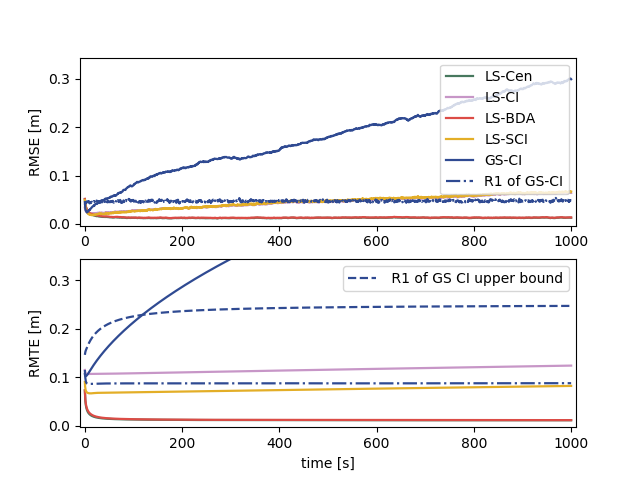
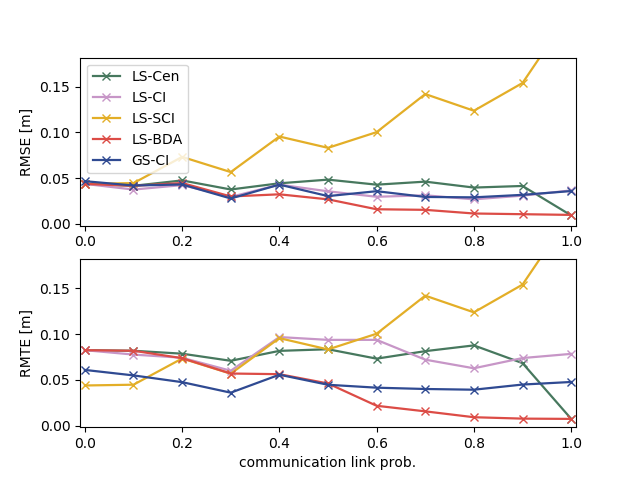

# Multirobot Localization Simulation

This is the simulation code for the paper "Resilient Multirobot Cooperative Localization with Explicit Communication" submitted to *IEEE Transaction on Robotics*.

## Multirobot Cooperative Localization Algorithm based on Covariance Intersection

This is our algorithm developed in the paper. The proposed algorithm contains 3 steps:

### Motion propagation update

### Observation update

### Communication update

## Other Multirobot Cooperative Localization Algorithms

We simulate 4 other algorithms for comparision. We rename and classify them to emphasize the structural difference. The first category is the local state (LS) algorithms, where each robot only tracks its own spatial state. The other category is the global state (GS) algorithms, where each robot tracks the state of the entire robot team.

### LS-Cen

### LS-CI

### LS-SCI

This algorithm follows the same strucutre of the proposed algorithm but the communication update is realized by the split covariance intersection in [].

### LS-BDA

## Usage

All the simulation parameters are specified in `sim_env.py`. One can specify the random seed here as well.

For boundedness analysis, just run `boundedness_sim.py`.

For topology analysis, please run `topology_sim.py`.

## Covariance Boundedness

One trial with dead reckoning only. With identical odometry inputs, the estimation positions are the same across all algorithms.

One trial with dead reckoning and observation. LS-CI and LS-SCI have close estimation results.

The averaged RMSE and RMTE over 100 trials.

## Observation and Communication Topologies

Deu to the detailed implementation of each algorithm, we first assume that communication is not necessary after the absolute observation. We then investigate the required communication links after the relative observation for each LS algorithms. 

algorithm   | relative observation 
------------ | ------------- 
LS\-Cen | all\-to\-all
LS\-CI, LS\-SCI | unidirectional
LS\-BDA | bidirectional

The averaged RMSE and RMTE over 25 randomly generated topologies. The observation link is established with probability 0.7.

## Reference